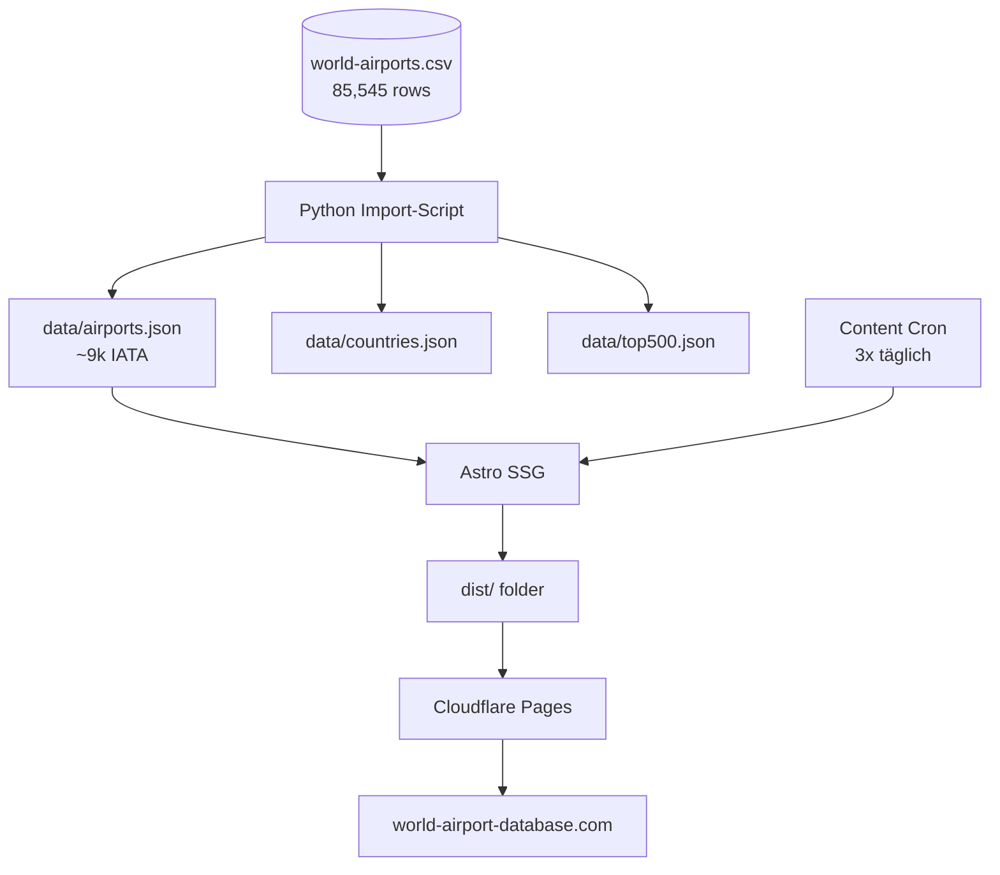

# First-Run Plan: World Airport Database MVP

## Status: ✅ Domain registriert + DNS + Cloudflare Pages

| Komponente | Status | URL |
|---|---|---|
| Domain | ✅ Registriert (Porkbun, apiAccess=1) | world-airport-database.com |
| DNS | ✅ ALIAS @ + CNAME www → airportdb.pages.dev | Propagiert |
| Cloudflare Pages | ✅ Projekt + Deploy live | https://87ebc85e.airportdb.pages.dev |
| Custom Domain | ✅ Hinzugefügt, Status: pending | world-airport-database.com |
| SSL | ⏳ Auto via Cloudflare (nach Propagation) | |
| GitHub | ✅ https://github.com/Loggableim/airportdb | |

---

## Phase 1: Daten-Import (Heute)

### 1.1 Python Import-Script bauen
`scripts/import-airports.py` — liest CSV, generiert JSON-Struktur für Astro.

```python
# data/airports.json (nur IATA-coded, ~9k)
# data/top500.json (Top 500 nach score)
# data/countries.json (247 Länder mit Airport-Counts)
# data/continents.json (7 Kontinente aggregiert)
```

### 1.2 Astro `generateStaticPaths()` für Airport-Seiten
Jede Airport-Seite bekommt:
- `/airports/[country-slug]/[airport-slug]/` → Profilseite
- `/countries/[country-slug]/` → Länderseite
- `/codes/iata/[code]/` → IATA Code Redirect-Seite
- `/codes/icao/[code]/` → ICAO Code Redirect-Seite

### 1.3 Top 500 Airports priorisieren
Nach Score + IATA + type=large_airport:
```
1. ATL (2,002,475) — Atlanta
2. ORD (1,503,175) — Chicago O'Hare
3. LAX (1,335,475) — Los Angeles
4. LHR (1,251,675) — London Heathrow
5. FRA (1,144,675) — Frankfurt
6. JFK (1,052,075) — New York JFK
... → Top 500
```

---

## Phase 2: Tools (Diese Woche)

### 2.1 Airport Distance Calculator ✅ (bereits im Mockup)
- SVG-Globe mit Great-Circle-Arc ✅
- Flying plane animation ✅
- Haversine ✅
- Muss in Astro-Komponente umgewandelt werden

### 2.2 IATA/ICAO Code Lookup ✅ (bereits im Mockup)
- 3 Filter (Continent, Type, Country) ✅
- Text-Suche ✅
- Oldschool-Tabelle ✅

### 2.3 Nearest Airport Finder (NEU)
```
/tools/nearest-airport/
```
- Eingabe: Stadt/Ort/Adresse
- Berechnung: nächstgelegene 5 Airports mit Distanz
- Karten-Integration mit Leaflet
- Lat/Lon via OpenStreetMap Nominatim API

### 2.4 Timezone by Airport Code (NEU)
```
/tools/airport-timezone/
```
- Dropdown → zeigt UTC Offset + aktuelle Zeit

### 2.5 CSV/API Download (NEU)
```
/tools/download/
```
- Download-Links für CSV, JSON, SQL
- Attribution-Requirements von OurAirports

---

## Phase 3: Content-Produktion (Ab Tag 2)

### 3.1 Content-Cron Job
```yaml
Schedule: 3x täglich (7:00, 15:00, 23:00)
Pro Run: 5 neue angereicherte Airport-Seiten
Themen-Pool: Top-Airports nach Region rotierend
```

### 3.2 Pro Airport-Seite:
- Hero mit IATA/ICAO + Name
- Daten-Tabelle (Type, City, Country, Coordinates, Elevation, Timezone)
- Leaflet-Karte (OpenStreetMap)
- Nearby Airports (berechnet aus CSV-Koordinaten)
- Affiliate-Links (Parking, Hotels, Lounges — Platzhalter)
- FAQ: "What airport is X?", "Which city is X?", "How far is X from city center?"
- JSON-LD (Airport schema.org markup)
- OG-Tags (Title, Description, Image)

### 3.3 Content-Angleichung (SEO)
- Jeder Artikel: 300+ Wörter Unique Content
- Interne Links zu Country-Seite + Nearby Airports
- "Book flights to X" Amazon/Booking Affiliate

---

## Phase 4: SEO & Indexing

### 4.1 Technisches SEO
- ✅ Sitemap.xml (Astro build generiert automatisch)
- ✅ Robots.txt
- ✅ OG-Tags (astro:head)
- ✅ JSON-LD schema.org/Airport
- ⬜ Google Search Console Verifikation
- ⬜ Bing Webmaster Tools

### 4.2 Crawl-Strategie
- Top 500 Airports = Prioritär (Crawl weekly)
- 9k IATA-Airports = Sekundär (Crawl monthly)
- 76k Non-IATA = Nur über Search auffindbar (kein HTML)

### 4.3 Backlink-Strategie
- GitHub Repo (README with Tools)
- Aviation-Foren (StackExchange, Reddit r/aviation)
- Travel Blogs (Distance Calculator embed)
- Open-Source Attribution (OurAirports listet uns?)

---

## Phase 5: MVP Go-Live Checklist

```
[ ] ✅ Domain registriert
[ ] ✅ DNS auf Cloudflare Pages
[ ] ✅ SSL aktiv (warte auf Propagation)
[ ] ⬜ Daten-Import Script
[ ] ⬜ 500 Airport-Seiten generiert
[ ] ⬜ Astro Build + Deploy
[ ] ⬜ Google Search Console
[ ] ⬜ Sitemap geprüft
[ ] ⬜ Erste Analytics-Daten
[ ] ⬜ Content-Cron aktiv
```

---

## Architektur: Astro Daten-Import



## Grobe Zeitabschätzung

| Phase | Aufwand | Fertig |
|-------|---------|--------|
| Daten-Import + Base Pages | 2-3h | Heute |
| 500 Airport-Seiten | 3-4h | Morgen |
| Tools (Nearest, Timezone) | 2-3h | Übermorgen |
| SEO + Sitemap | 1-2h | Parallel |
| Content-Cron | 1h | Nach Launch |
| **MVP gesamt** | **~10-12h** | |

## Wichtigster Takeaway

Die **Tools** sind der Hebel für Traffic — nicht die Daten-Seiten allein. Der Distance Calculator und Nearest Airport Finder sind natürliche Link-Magneten. Der CVS Download ist der API-Gateway für Developer-Traffic. **Die Tools müssen von Tag 1 mitlaufen.**